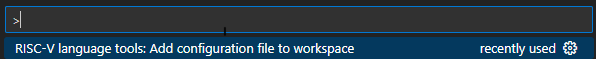

# Mekatrol RISC-V assembly tools

## RISC-V Formatter

### Overview

The RISC-V tools includes a formatter to provide consistent layout for assembly language (typically .S) files. The formatter includes various settings to define layout columns, conversion of tabs to spaces, automatic removal of whitespace at the end of lines and ability to specify supported RISC-V instruction sets.

### **Features**

#### **Token types**

The formatter works by tokenising the content of a file, line by line. Any non blank line within the file contains one of the following primary token types:  

- ***Directive*** - one of the assembly directives such as `.section`, `.bss` and `.data`.
- ***Label*** - a code label, e.g. `LABEL_1:`.
- ***Local Label*** - a numeric local code label, e.g. `1:`.
- ***Instruction*** - a risc-v op code instruction, e.g. `la`, `call`, `addi`.

A ***Comment*** is a conditional primary token in that it is only a primary token when it is the only non whitespace token on a line, e.g.  
` # Comment that is a primary token `  
but not when it follows other primary tokens, e.g.  
`li      a0,R32_RCC_CFGR0 # Comment that is NOT a primary token`

#### **Alignment**

The formatter works by aligning tokens of a line to defined columns within the line. The are three configurable column types.

- ***Primary Token Column*** - is the column that the primary token is aligned within the line. A primary token is the main token for a file and is typically a directive (e.g. `.section`, `.bss`), label (e.g. `LABEL_1:`) or an instruction (e.g. `la`, `call`, `j`).

- ***Data Token Column*** - is the column that any data associated with the primary column is aligned within the line. E.g. for a command the data is the register or immediate values that define the instruction data (the `a0,R32_RCC_CFGR0` in the example `li      a0,R32_RCC_CFGR0`).

- ***Comment Column*** - is the column that any comment is aligned within the line. There are two comment column configuration options:  
  - When the comment is the only item on a line (no primary token).
  - When the comment following a primary token (and any data).

#### **Whitespace**

There are three whitespace processing steps, two of which are configurable.  

- The formatter removed trailing whitespace from the end each line. This option is not currently configurable and is on permanently.

- Convert tabs to whitespace using the `tabs.replaceTabsWithSpaces` configuration option.

- Include file trailing blank line (blank line at end of file) with the `endOfFileHasBlankLine` configuration option.

### Configuration file

You can use the formatter with default settings, however you can also change the settings by adding a `.criscv` JSON file to your workspace. Adding a configuration file to your workspace means that the configuration can be committed to your GIT repository along with your code and then anyone who checkouts your repository will get the same formatter settings. This helps to ensure that pull requests are not polluted with changes relating to formatting inconsistencies across the team.

### Adding a `.criscv` file

> A `.criscv` file can be added to your workspace by opening the Command Palette (Ctrl+Shift+P) and typing *RISC-V language tools*
> 

#### ***Default configuration***

```json
{
  "meta": {
    "version": 2,
    "help": "See: https://github.com/mekatrol/vscode-riscv-extension for description of configuration values."
  },
  "endOfFileHasBlankLine": true,
  "commentOnlyLineColumn": 1,
  "commentCharacter": "#",
  "disabled": false,
  "tabs": {
    "replaceTabsWithSpaces": 2,
    "tabWidth": 2
  },
  "directive": {
    "primaryColumn": 5,
    "dataColumn": 15,
    "commentColumn": 40
  },
  "label": {
    "primaryColumn": 5,
    "dataColumn": 15,
    "commentColumn": 40,
    "hasOwnLine": true
  },
  "localLabel": {
    "primaryColumn": 5,
    "dataColumn": 15,
    "commentColumn": 40,
    "hasOwnLine": true
  },
  "instruction": {
    "supportedInstructionSets": [
      "R32I",
      "Pseudo"
    ],
    "primaryColumn": 5,
    "dataColumn": 15,
    "commentColumn": 40
  },
  "value": {
    "primaryColumn": 5,
    "dataColumn": 15,
    "commentColumn": 40
  }
}
```

#### ***Meta configuration***

The configuration file contains the `meta` element. This element provides information to manage a configuration file including the version of the configuration as well as where to obtain help (this page).

#### ***Configuration settings***

`endOfFileHasBlankLine` [**true | false**] True to add blank line at end of file, false for no blank line.  
Default is **true**.

`commentOnlyLineColumn` [**>= 1 | null**] The number column to place the comment of a ***comment only*** line. No processing alignment of comment tokens is performed if this setting is `null`.  
Default is **1**.

`commentCharacter` [**# | ;**] The single character to use as the comment starting character. Must be one of '***#***' or '***;***'.  
Default is **#**.

`disabled` [`false` | `true`] Setting the value to boolean `true` (not the string 'true') disables formatting. An invalid value will also disable formatting.
Default is `false`.

`tabs.replaceTabsWithSpaces` [**>= 1 | null**]. For `null` tabs are not replaced with spaces. For [`>= 1`] tabs are replaced with the number of spaces specified.  
Default is **2**.

`tabs.tabWidth` [**>= 1**] The number of spaces that a tab equates to. Used to determine column numbering when padding out columns (primary, data, comment). e.g. a tabWidth of 1 will add 1 to the column number when a tab is found, whereas a tabWidth of 4 will add 4 to the column number when a tab is found. This setting is redundant if `replaceTabsWithSpaces` = `true` (because tabs will be replaced with spaces!).  
Default is **2**.

`directive.primaryColumn` [**>= 1 | null**]. The column to place the directive (e.g. `.section`). A value of 5 will position the directive in the 5th column (ie 4 spaces then the directive). No processing alignment of directive primary tokens is performed if this column is `null`.  
Default is **5**.

`directive.dataColumn` [**>= 1 | null**]. The column for any data following the directive. No processing alignment of data tokens is performed if this setting is `null`.  
Default is **15**.

`directive.commentColumn` [**>= 1 | null**]. The column for any comment following the directive. No processing alignment of non-primary comment tokens is performed if this setting is `null`.  
Default is **40**.

`label.primaryColumn` [**>= 1 | null**]. The column to place the label (e.g. `LABEL_1:`). A value of 3 will position the label in the 3rd column (ie 2 spaces then the label). No processing alignment of label primary tokens is performed if this setting is `null`.  
Default is **5**.

`label.dataColumn` [**>= 1 | null**]. The column for any data following the label. No processing alignment of data tokens is performed if this setting is `null`.  
Default is **15**.

`label.commentColumn` [**>= 1 | null**]. The column for any comment following the label. No processing alignment of non-primary comment tokens is performed if this setting is `null`.  
Default is **40**.

`label.hasOwnLine` [**true | false**]. True to force label onto its own line, false to leave label as is (i.e. can have instructions on the same line).  
e.g. `LABEL_1: li t0,0x01`.  
Default is **true**.

`instruction.primaryColumn` [**>= 1 | null**]. The column to place the primary instruction (e.g. `addi`). A value of 4 will position the instruction in the 4th column (ie 3 spaces then the instruction). No processing alignment of instruction primary tokens is performed if this setting is `null`.  
Default is **5**.

`instruction.dataColumn` [**>= 1 | null**]. The column for any data following the instruction. No processing alignment of data tokens is performed if this setting is `null`.  
Default is **15**.

`instruction.commentColumn` [**>= 1 | null**]. The column for any data following the instruction. No processing alignment of non-primary comment tokens is performed if this setting is `null`.  
Default is **40**.

`instruction.supportedInstructionSets` Array of supported instruction sets, one of `[R32I, R64I, RV32M, RV64M, RV32A, RV64A, RV32F, RV64F, RV32D,RV64D, Pseudo, Compressed]`.  
Default is **[R32I, Pseudo]**.

`value.primaryColumn` [**>= 1 | null**]. The column to place the value (e.g. `.section`). A value of 5 will position the value in the 5th column (ie 4 spaces then the value). No processing alignment of value primary tokens is performed if this column is `null`.  
Default is **5**.

`value.dataColumn` [**>= 1 | null**]. The column for any data following the value. No processing alignment of data tokens is performed if this setting is `null`.  
Default is **15**.

`value.commentColumn` [**>= 1 | null**]. The column for any comment following the value. No processing alignment of non-primary comment tokens is performed if this setting is `null`.  
Default is **40**.
